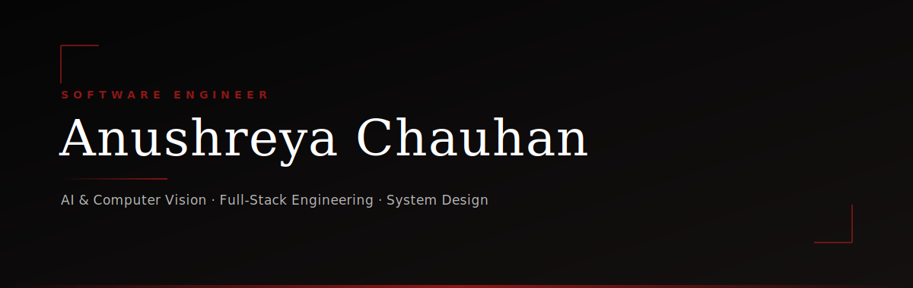

 

 

<b>FINAL YEAR · B.TECH INFORMATION SCIENCE &amp; ENGINEERING · PRESIDENCY UNIVERSITY</b>

 

## About

I build systems at the intersection of computer vision, applied machine learning, and full-stack engineering — from real-time detection pipelines to adaptive learning platforms used by real students. My interest is in software that behaves intelligently under constraints, not software that merely demos well.

Currently completing my final year with a CGPA of 8.09, heading toward a career in software engineering with a focus on AI-driven systems.

 

## Current Focus

<table>
<tr>
<td width="25%" valign="top">

**Machine Learning**
Applied CV & deep learning systems

</td>
<td width="25%" valign="top">

**Full-Stack**
End-to-end product engineering

</td>
<td width="25%" valign="top">

**Systems**
DSA & system design fundamentals

</td>
<td width="25%" valign="top">

**Backend**
APIs, services, data layers

</td>
</tr>
</table>

 

## Tech Stack

<table>
<tr>
<td valign="top" width="20%">

**Languages**

Python
Java
JavaScript
SQL
C

</td>
<td valign="top" width="20%">

**Frontend**

React
HTML / CSS
Bootstrap

</td>
<td valign="top" width="20%">

**Backend**

Flask
FastAPI
REST APIs

</td>
<td valign="top" width="20%">

**AI / ML**

TensorFlow
Keras
OpenCV
MediaPipe
Scikit-Learn

</td>
<td valign="top" width="20%">

**Tooling**

Git · GitHub
VS Code
Jupyter
Postman
MySQL · SQLite

</td>
</tr>
</table>

 

## Featured Projects

<table>
<tr>
<td width="100%">

### NeuroAdapt AI
**Flagship Project**

An AI-powered adaptive learning platform built for neurodiverse students — combining personalized learning paths with a dyslexia-friendly interface and dedicated ADHD-support features.

**Built with** — React · Flask · TensorFlow · REST APIs
**Includes** — Teacher dashboard · Parent dashboard · AI-driven recommendations · Progress analytics
**Role** — Team Lead, Frontend & UI/UX

</td>
</tr>
</table>

<table>
<tr>
<td width="100%">

### Visual Fatigue Detection System
**Computer Vision · Deep Learning**

A real-time fatigue detection system that tracks eye closure patterns using facial landmark estimation and a lightweight CNN classifier — designed to run efficiently without specialized hardware.

**Built with** — OpenCV · MediaPipe Face Mesh · TensorFlow · MobileNetV2
**Core technique** — Eye Aspect Ratio (EAR) computed from live facial landmarks

</td>
</tr>
</table>

<table>
<tr>
<td width="48%" valign="top">

### Hoomie
*A project worth a closer look — details incoming.*

</td>
<td width="48%" valign="top">

### Emurze
*A project worth a closer look — details incoming.*

</td>
</tr>
</table>

 

## GitHub Analytics

 

## Developer Philosophy

"The interface is the argument — if a system needs an explanation, it isn't finished yet."

 

## Currently Learning

FastAPI · Distributed systems fundamentals · Advanced system design patterns

 

## Let's Connect

  

© Anushreya Chauhan

